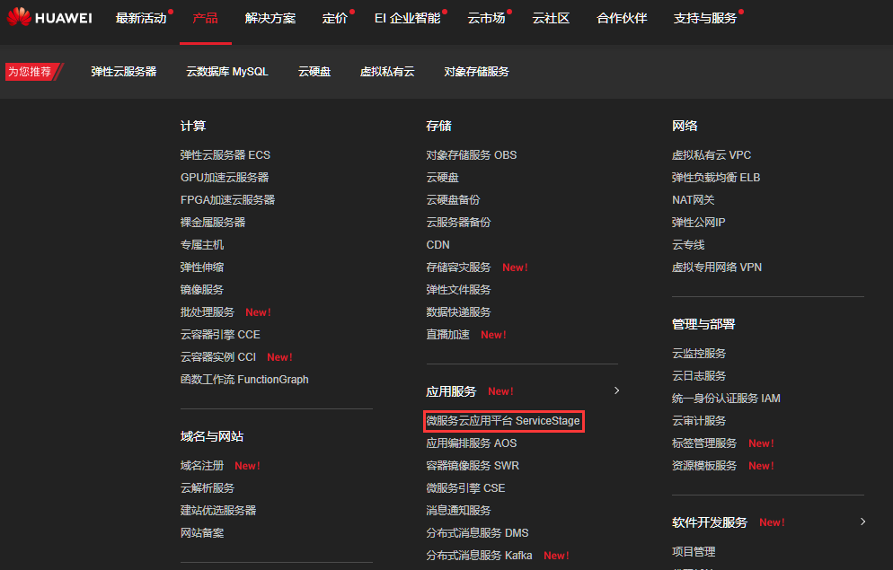
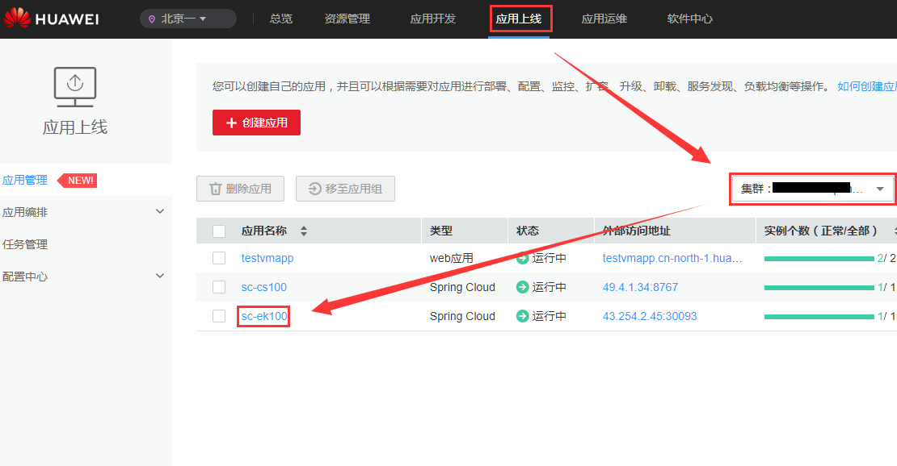

# springcloud-sample

华为云部署spring cloud物理多组 eureka 示例项目,该项目主要是讲述如何在华为云 ServiceStage 平台上部署 spring cloud eureka ,实现高可用.

## 使用华为云一键部署eureka高可用集群

* 登录华为微服务云应用平台[`ServiceStage` ](https://console.huaweicloud.com/servicestage)



* 进入ServiceStage, 在 ` 应用上线`界面,点击 `创建应用` 


* 选择 `SpringCloud 服务` 


* eureka 参数配置
  * 基本 参数 配置
  
  
  
  * 容器规格配置
  
  
  
 > **`资源配置`** , 仅做参考: 
 > * 搭建 `eureka` 高可用集群,建议 实例数设置为` 3 `
 >   1. 注册实例数 `500 以下` , CPU 申请 `0.2` 核, 限制 `0.25` 核 . 内存申请 `1.0` G 限制 `1.3` G 
 >   2. 注册实例数 `500 ~ 1000` , CPU 申请 `0.3` 核, 限制 `0.4` 核 . 内存申请 `1.0` G 限制 `1.5` G
 >   3. 注册实例数 `1000 ~ 2000` , CPU 申请 `0.3` 核, 限制 `0.5` 核 . 内存申请 `1.2` G 限制 `1.6` G
 > * 部署config server 高可用集群, 建议实例数量为 `2`
 >   1. CPU 申请 `0.1` 核, 限制 `0.2` 核 . 内存申请 `0.8` G 限制 `1.0` G
 > 
 > 企业有集群部署经验可以按照自己的经验,对上面数据进行修改, 还可以根据集群资源情况适当调整. 建议如果有条件,适当调大CPU和内存资源分配.
 >  
 > **`访问方式`** : 
 > 1. `集群内访问` : 只需要设置 `访问端口` , 默认只能在集群内部访问 该`高可用 eureka 集群`. 建议使用` curl http://${应用名称}:${访问端口}` 测试eureka 集群是否成功部署.
 >
 > 2. `VPC 内访问` : 需要指定一个负载均衡,目的是提供一个在 VPC 内能够访问的 IP, 这样在同一VPC 内的所有集群都可以通过负载均衡访问到 该 `高可用 eureka 集群`. 建议使用 `curl http://${vpc_ip}:${访问端口}` 测试eureka集群是否成功部署.
 >
 > 3. `公网访问`: 类似 `VPC内访问`,需要指定负载均衡,只不过该负载均衡在公网也能被访问到. 其他类似 `VPC内访问` .
 
*  **`创建应用`** > **`返回应用管理`** , 查看自己部署的 eureka 集群 .
 
 Notes : _eureka 集群启动的时候较为缓慢, 由于eureka 部署的时候安装了 `探针` 功能, 而实例的启动时间无法精确指定,所以在启动之前.实例列表会显示 `实例异常`,并不影响运行,启动成功后,该实例会显示`运行中`,然后启动第二个实例,直到所有的实例启动成功._ 
 
 
 
## 验证 eureka 高可用集群:

* **集群内访问**: 


Notes: 建议使用 服务名+ 端口的访问方式.  

* **VPC内 访问** :


* **公网访问** :


## eureka 高可用集群运维管理
在 `应用管理界面` 点击创建的 `spring cloud 应用`


进入应用的运维管理界面


> * **实例列表** : 查看该应用的实例基本信息,例如: 资源限制、部署节点等.
> * **访问方式** : 增加访问 该应用的方式. 例如原本部署的时候是集群内访问,可以通过增加访问方式, 实现在集群外甚至是公网访问该应用.
> * **更新升级** : 更改部署应用的环境变量, 资源配置, 健康检查 等.
> * **运行日志** : 查看应用实例的 运行日志.


## 本地SpringCloud应用接入云上eureka集群

本例演示了2个本地SpringCloud应用[**eureka-client-provider**](/eureka-client-provider)(服务提供者)
和[**eureka-client-consumer-feign**](/eureka-client-consumer-feign)(服务消费者)
如何通过公网访问的`eureka`集群实现服务注册和服务发现.


#### 启动服务提供者

本例中的服务提供者默认监听本机端口`8776`

```bash
cd eureka-client-provider
mvn clean install
java -Deureka.client.service-url.defaultZone=http://{eureka外部访问地址}/eureka/ -jar target/eureka-client-provider-0.0.1-SNAPSHOT.jar 
```

#### 启动服务消费者

本例中的服务消费者默认监听本机端口`8778`

```bash
cd eureka-client-consumer-feign
mvn clean install
java -Deureka.client.service-url.defaultZone=http://{eureka外部访问地址}/eureka/ -jar target/eureka-client-consumer-feign-0.0.1-SNAPSHOT.jar 
```


#### 发起请求调用服务消费者

```bash
curl -s http://127.0.0.1:8778/sayHello
# hello, huawei. There is cse with port : 8776
```


Notes: 以上服务消费者借助Feign能力调用服务提供者的接口,如果习惯使用`RestTemplate`,这里提供另一种实现[**eureka-client-consumer-ribbon**](/eureka-client-consumer-ribbon) 

## enjoy your eureka cluster ! 

## 使用 华为云一键部署spring cloud config server 集群

### 单独部署 config server.  _ps: 不会把该config server 注册到 spring cloud eureka 做服务发现_

* 登录华为微服务云应用平台[`ServiceStage` ](https://console.huaweicloud.com/servicestage)


* 进入ServiceStage, 在 **`应用上线`** 界面,点击 **`创建应用`**


* 选择 **`SpringCloud 服务`** 


* config server 参数配置
	* 基本参数配置


* 
	* 容器规格配置


> 访问方式 **config server** 同 **eureka** 类似, 可以参考 eureka相关介绍. ps: 建议在有条件的情况下, 合理加大CPU
> 和内存资源配置.

*  **`创建应用`** > **`返回应用管理`** , 查看自己部署的 config server 集群 .
#### ps: 一定要注意保证部署config server 的节点可以访问到你的 github 或者华为云 devcloud 地址, 否则会因为无法荡下配置文件造成 config server 实例启动失败.
 


* 点击 **应用名称** , 可以进一步查看部署的config server的详情.


## 验证 conifig server 高可用集群

* 健康检查


* 直接访问配置文件


## 本地Spring Cloud 应用接入云上config server集群.

本例演示了一个本地springcloud应用[**conifg-client-only**](/config-client-only)

#### 启动config-client从config server 读取配置

本例client 监听 端口8991

```bash
cd config-client-only
mvn clean install
java -jar -Dspring.cloud.config.uri=http://${configserver外部访问地址}:${port}/ -jar target/config-client-only-0.0.1-SNAPSHOT.jar 
```

验证读取的配置

```
curl -s http://localhost:8991/hello
# hello, huawei. There is cse in private, I change It

```

### 部署 config server, 并且注册到eureka 做服务发现.

* 有可用的 eureka 集群做服务发现


* 新建config server 应用, 注意注册中心要填 可用的eureka集群


> **注册中心地址** : 
> 1. 如果 eureka 集群和config server 在同一个集群,建议通过 **内部域名** 访问. 格式为 http://${eureka服务名称}:${端口}/eureka/. 如上图: http://rkd-eureka:8761/eureka/
> 2. 如果不在同一个集群中, 则必须通过 **公网IP** 交互. 如上图 : http://49.4.88.128:8761/eureka/

*  **`创建应用`** > **`返回应用管理`** , 查看自己部署的 config server 集群 .
#### ps: 一定要注意保证部署config server 的节点可以访问到你的 github 或者华为云 devcloud 地址, 否则会因为无法荡下配置文件造成 config server 实例启动失败.


## 验证 conifig server 高可用集群

* 健康检查


* 查看 eureka 是否成功注册


## 本地Spring Cloud 应用接入云上config server集群.

本例演示了一个本地springcloud应用[**conifg-client**](/config-client)

#### 启动config-client从 eureka 服务发现config server,最后从config server 读取配置

本例client 监听 端口2002

```bash
cd config-client
mvn clean install
java -jar -Deureka.client.service-url.defaultZone=http://{eureka外部访问地址}/eureka/ -Dspring.cloud.config.discovery.service-id=${configserver服务名称} -jar target/config-client-0.0.1-SNAPSHOT.jar 
```

验证读取的配置

```
curl -s http://localhost:2002/hello
# hello, huawei. There is cse in private, I change It

```

## enjoy your config server cluster !
