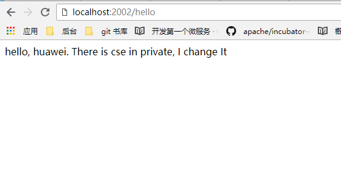

# eureka-client-provider

使用 华为云 `config server 高可用集群 `, 示例 client ps: 该实例首先从eureka 做服务发现,然后再从config server 读取配置
### 配置 

依赖 `pom.xml`
```xml
  <properties>
    <project.build.sourceEncoding>UTF-8</project.build.sourceEncoding>
    <project.reporting.outputEncoding>UTF-8</project.reporting.outputEncoding>
    <java.version>1.8</java.version>
    <spring-cloud.version>Finchley.SR1</spring-cloud.version>
  </properties>

  <dependencies>
    <dependency>
      <groupId>org.springframework.cloud</groupId>
      <artifactId>spring-cloud-starter-netflix-eureka-client</artifactId>
    </dependency>
    <dependency>
      <groupId>org.springframework.boot</groupId>
      <artifactId>spring-boot-starter-web</artifactId>
    </dependency>
    <dependency>
      <groupId>org.springframework.cloud</groupId>
      <artifactId>spring-cloud-starter-config</artifactId>
    </dependency>
    <dependency>
      <groupId>org.springframework.boot</groupId>
      <artifactId>spring-boot-starter-actuator</artifactId>
    </dependency>
    <dependency>
      <groupId>org.springframework.boot</groupId>
      <artifactId>spring-boot-starter-test</artifactId>
      <scope>test</scope>
    </dependency>
  </dependencies>
```
* 配置 `bootstrap.yaml `

```yaml
spring:
  application:
    name: rkd-config-client
  cloud:
    config:
      discovery:
        enabled: true
        service-id: rkd-cofig # 写实际的 config server 服务名称
      profile: dev
      name: foo
      label: master
eureka:
  client:
    service-url:
      defaultZone: http://114.116.7.100:8761/eureka/ # 实际的eureka 集群访问地址
    fetch-registry: true
    register-with-eureka: false

```

* 配置 `application.yaml`

```yaml
server:
  port: 2002
spring:
  application:
    name: rkd-config-client

management:
  endpoints:
    web:
      exposure:
        include: refresh

```

* 添加示例 controller , `ConfigClientController.java`

```java

@RefreshScope
@RestController
@Configuration
public class ConfigClientController {

  @Value("${hello.huawei:error}")
  private String name;

  @RequestMapping("/hello")
  public String version() {
    return this.name;
  }

}

```

* 启动该项目,可以直接访问 http://localhost:2002/hello 验证.


