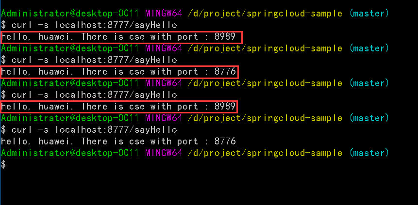

# 配置 eureka-client-consumer
使用华为云 `eureka 高可用集群`, rest + ribbon 消费者示例
  * 新建maven 项目,依赖如下: 
  ```xml
    <properties>
      <project.build.sourceEncoding>UTF-8</project.build.sourceEncoding>
      <project.reporting.outputEncoding>UTF-8</project.reporting.outputEncoding>
      <java.version>1.8</java.version>
      <spring-cloud.version>Finchley.SR1</spring-cloud.version>
    </properties>
  
    <dependencies>
  
      <dependency>
        <groupId>org.springframework.cloud</groupId>
        <!--默认已经集成了 spring-cloud-starter-netflix-ribbon-->
        <artifactId>spring-cloud-starter-netflix-eureka-client</artifactId>
      </dependency>
    <dependency>
      <groupId>org.springframework.boot</groupId>
      <artifactId>spring-boot-starter-web</artifactId>
    </dependency>
    <dependency>
      <groupId>org.springframework.boot</groupId>
      <artifactId>spring-boot-starter-test</artifactId>
      <scope>test</scope>
    </dependency>
  </dependencies>
  ```
  *  配置 application.yaml
  ```yaml
  server:
    port: 8777
  spring:
    application:
      name: consumer-ribbon
  
  eureka:
    client:
      service-url:
        defaultZone: http://49.4.95.115:8761/eureka/
      fetch-registry: true
      register-with-eureka: false # consumer 不需要把自己注册到 eureka server
  ```
  * 配置 全局 config, 开启服务负载均衡
  
  ```java
  @Component
  @Configuration
  public class WebConfig {
  
    @Bean
    @LoadBalanced
    public RestTemplate restTemplate() {
      return new RestTemplate();
    }
  
  }
  ```
  
  * 添加注解 `@EnableEurekaClient`
  
  ```java
  
  @EnableEurekaClient
  @SpringBootApplication
  public class EurekaClientConsumerRibbonApplication {
  
    public static void main(String[] args) {
      SpringApplication.run(EurekaClientConsumerRibbonApplication.class, args);
    }
  }
  ```
  
  * 添加示例 consumer,调用 provider 提供的 `sayHello()`
  ```java
  @RestController
  public class EurekaClientSample {
  
    @Autowired
    private RestTemplate restTemplate;
  
    private static final String PROVIDER_HELLO_URL_PREFIX = "http://default-eureka-provider";
  
    @RequestMapping("/sayHello")
    public String sayHello() {
      String url = PROVIDER_HELLO_URL_PREFIX + "/sayHello";
      String hello = restTemplate.getForObject(url, String.class);
  
      return hello == null ? "ERROR" : hello;
    }
  }
  ```
  
  * 启动消费者,并且测试 轮询机制. ps: 要启动两个provider 才能测试 Ribbon 简单的轮询负载均衡,对应模块 `eureka-client-provider` 和 `eureka-client-provider-copy`
  
  

